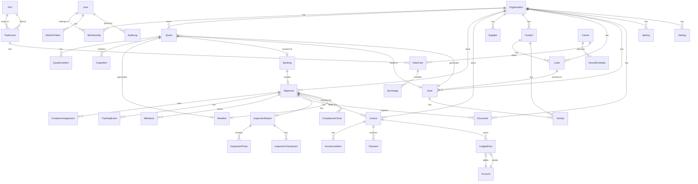

# Ronda Ship — Entity Relationship Diagram



## Key Design Decisions

### Multi-tenancy
- `Organization` is the tenant root
- All tenant data is scoped via `organizationId`
- `Membership` table implements RBAC with `UserRole[]` array per member
- No shared tables between tenants except global reference data (ports, carriers, rate cards, compliance rules)

### Financial Data
- All monetary values stored as integer **minor units** (cents/halalas) to avoid floating-point issues
- `AccountingCategory` enum: `COGS | OPEX | DUTY_VAT | MARGIN` — drives P&L reporting
- Double-entry ledger: every invoice creates corresponding `LedgerEntry` records

### Audit Trail
- `AuditLog` captures before/after JSON for all mutations
- `TrackingEvent` is append-only (never updated, only created)
- `InspectionPhoto.sha256Hash` ensures photo integrity

### Compliance
- `ComplianceRule` stored in DB (overridable per deployment)
- Built-in rules also in `@ronda/core/compliance` for offline use
- `ComplianceCheck` records each check result per shipment

### Quote → Booking → Shipment Flow
```
Quote (DRAFT) → Quote (QUOTED) → Booking → Shipment (BOOKED → ... → DELIVERED)
```
